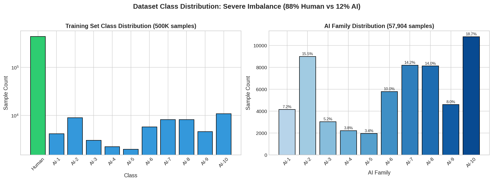

# AI-Generated Code Detection: Exploration Report

**Competition**: SemEval 2026 Task 13 Subtask B
**Date**: November 29, 2025

---

## 1. Task Description

### Competition Context
SemEval 2026 Task 13 Subtask B focuses on detecting AI-generated code and identifying which AI model family produced it.

### Objective
Classify code snippets into 11 categories:
- **Label 0**: Human-written code
- **Labels 1-10**: AI-generated code from 10 different AI model families

### Challenge
This is a two-tier classification problem requiring:
1. **Binary detection**: Distinguish human-written code from AI-generated code
2. **Multi-class identification**: Determine which of 10 AI families generated the code

The task is complicated by severe class imbalance (88% human vs 12% AI) and subtle differences between AI model outputs.

---

## 2. Data Exploration

### Dataset Statistics

| Split | Samples | Purpose |
|-------|---------|---------|
| Training | 500,000 | Model training |
| Validation | 100,000 | Model selection & hyperparameter tuning |
| Test | 1,000 | Final submission (labels not provided) |

### Class Distribution (Training Set)

| Label | Class | Count | Percentage |
|-------|-------|-------|------------|
| 0 | Human | 442,096 | 88.42% |
| 10 | AI-10 | 10,810 | 2.16% |
| 2 | AI-2 | 8,993 | 1.80% |
| 7 | AI-7 | 8,197 | 1.64% |
| 8 | AI-8 | 8,127 | 1.63% |
| 6 | AI-6 | 5,783 | 1.16% |
| 9 | AI-9 | 4,608 | 0.92% |
| 1 | AI-1 | 4,162 | 0.83% |
| 3 | AI-3 | 3,029 | 0.61% |
| 4 | AI-4 | 2,227 | 0.45% |
| 5 | AI-5 | 1,968 | 0.39% |

**Key Challenge**: Severe class imbalance with 88% human-written code and less than 3% for any individual AI family.


*Figure 1: Dataset class distribution showing severe imbalance (88% Human vs 12% AI)*

### Programming Languages

The dataset covers 8 programming languages:

| Language | Count | Percentage |
|----------|-------|------------|
| Java | 137,076 | 27.42% |
| Python | 136,709 | 27.34% |
| C# | 62,781 | 12.56% |
| JavaScript | 41,780 | 8.36% |
| C++ | 36,581 | 7.32% |
| Go | 29,685 | 5.94% |
| PHP | 29,198 | 5.84% |
| C | 26,190 | 5.24% |

### Feature Engineering

We extracted **36 engineered features** organized into three categories:

#### A. Basic Statistics (9 features)
Simple statistical measures computed directly from code strings:
- `char_count` - Total character count
- `line_count` - Number of lines
- `word_count` - Number of whitespace-separated tokens
- `avg_line_length` - Average characters per line
- `space_count` - Number of space characters
- `tab_count` - Number of tab characters
- `alphanum_ratio` - Ratio of alphanumeric characters
- `special_char_ratio` - Ratio of special characters
- `newline_ratio` - Ratio of newline characters

#### B. Code Complexity (19 features)
Computed using the Radon library for code quality analysis:

**Lines of Code Metrics:**
- `loc`, `sloc`, `lloc` - Total, source, and logical lines
- `comments`, `blank`, `multi`, `single_comments` - Comment and blank line counts

**Cyclomatic Complexity:**
- `cc_max`, `cc_mean`, `cc_total`, `cc_count` - Control flow complexity measures

**Halstead Metrics:**
- `halstead_vocabulary`, `halstead_length`, `halstead_volume`
- `halstead_difficulty`, `halstead_effort`, `halstead_bugs`, `halstead_time`

**Maintainability:**
- `maintainability_index` - Code quality score (0-100)

#### C. Lexical Diversity (8 features)
Computed using the LexicalRichness library:
- `token_count`, `unique_tokens`, `avg_token_length`
- `ttr` - Type-Token Ratio
- `mtld` - Measure of Textual Lexical Diversity
- `mattr` - Moving Average Type-Token Ratio
- `keyword_count`, `keyword_ratio` - Programming keyword usage

---

## 3. Used Approach

### Two-Stage Cascaded Pipeline

We implemented a cascaded classification architecture that separates the problem into two specialized stages:

```
Input: 36 engineered features + raw code string
                    |
                    v
    +---------------------------------------+
    |  STAGE 1: Binary Classification       |
    |  XGBoost (Human=0 vs AI=1)            |
    |  Accuracy: 96.60%                     |
    +---------------------------------------+
                    |
         +----------+----------+
         |                     |
         v                     v
    pred=0 (Human)        pred=1 (AI)
         |                     |
         v                     v
    Output: Label 0      Pass to Stage 2
                               |
                               v
    +---------------------------------------+
    |  STAGE 2: Multi-class (10 classes)    |
    |  CodeT5p-770m Transformer             |
    |  Accuracy: 47.12%                     |
    +---------------------------------------+
                    |
                    v
           Output: Labels 1-10
```

### Design Rationale

1. **Cascaded approach**: Stage 1 filters approximately 57% of samples as human-written, significantly reducing the computational burden on Stage 2.

2. **Complementary methods**:
   - Stage 1 uses engineered features (fast, interpretable, effective for binary distinction)
   - Stage 2 uses transformer embeddings (captures semantic patterns for fine-grained AI family classification)

3. **Class imbalance handling**: Both stages employ class weighting:
   - Stage 1: `scale_pos_weight=7.5` for XGBoost
   - Stage 2: `class_weight='balanced'` in CrossEntropyLoss

4. **Shared preprocessing**: A single StandardScaler fitted on training data is used across both stages to ensure feature space consistency.

---

## 4. Explored Configurations

### Stage 1: Binary Classifiers

| Model | Key Hyperparameters | Notes |
|-------|---------------------|-------|
| **XGBoost** | n_estimators=300, max_depth=10, lr=0.3, scale_pos_weight=7.5 | GPU-accelerated, best performance |
| **SVM Linear** | C=10.0, loss=squared_hinge, class_weight=balanced | Simple baseline |
| **MLP** | hidden=[256,128,64], dropout=0.3, lr=0.001, threshold=0.85 | GPU-accelerated, macro F1 optimized |

### Stage 2: Multi-class Classifiers

| Model | Architecture | Embedding Dim | Key Parameters |
|-------|-------------|---------------|----------------|
| **CodeT5p-220m** | Frozen encoder + trainable head | 768 | batch=256, lr=2e-4, epochs=5 |
| **CodeT5-Large** | Frozen encoder + trainable head | 1024 | batch=256, lr=2e-4, epochs=5 |
| **CodeT5p-770m** | Frozen encoder + trainable head | 1024 | batch=256, lr=2e-4, epochs=12 |
| **CodeT5p-770m Hybrid** | Encoder embeddings + 36 features | 1024+36=1060 | batch=256, lr=2e-4, epochs=12 |

### CodeT5p-770m Hyperparameter Search

We conducted a grid search over learning rate and dropout:

| Config | Learning Rate | Dropout |
|--------|--------------|---------|
| Config 1 | 1e-4 | 0.3 |
| Config 2 | 1e-4 | 0.5 |
| **Config 3** | **2e-4** | **0.3** |
| Config 4 | 2e-4 | 0.5 |

---

## 5. Comparison of Configurations

### Stage 1 Performance Comparison

| Model | Accuracy | Macro F1 | Training Time | Model Size |
|-------|----------|----------|---------------|------------|
| **XGBoost** | **96.60%** | **0.9259** | 147 sec | 6.0 MB |
| MLP (macro F1 opt) | 89.18% | 0.7749 | 18.5 sec | 216 KB |
| SVM Linear | 75.13% | 0.6211 | 309 sec | 4.0 KB |

**Winner**: XGBoost with a significant margin (+7.4% accuracy, +0.15 macro F1 over MLP)


*Figure 2: Stage 1 binary classifier comparison across accuracy, macro F1, and training time*

**Analysis**: XGBoost's gradient boosting approach with proper class weighting (`scale_pos_weight=7.5`) effectively handles the binary classification task. The MLP, despite macro F1 optimization and threshold tuning, could not match XGBoost's performance.

### Stage 2 Performance Comparison

| Model | Accuracy | Macro F1 | Weighted F1 | Training Time |
|-------|----------|----------|-------------|---------------|
| **CodeT5p-770m Config3** | **47.12%** | 0.4279 | **0.4388** | 103 min |
| CodeT5p-770m Hybrid | 46.95% | **0.4284** | 0.4368 | 103 min |
| CodeT5p-770m Base | 45.60% | 0.4081 | 0.4168 | 103 min |
| CodeT5p-770m Config1 | 45.53% | 0.4092 | 0.4199 | 103 min |
| CodeT5-Large | 44.91% | 0.4050 | 0.4067 | 46 min |
| CodeT5p-770m Config2 | 44.11% | 0.3982 | 0.4063 | 103 min |
| CodeT5p-220m | ~45.6% | ~0.41 | ~0.42 | 16 min |

**Winner**: CodeT5p-770m Config3 (lr=2e-4, dropout=0.3) with 47.12% accuracy


*Figure 3: Stage 2 multi-class classifier comparison across accuracy, macro F1, and training time*

### Hyperparameter Impact Analysis

| Factor | Impact | Observation |
|--------|--------|-------------|
| Learning Rate (2e-4 vs 1e-4) | +1.6% accuracy | Higher learning rate converges to better optimum |
| Dropout (0.3 vs 0.5) | +1.5% accuracy | Lower dropout preserves more information |
| Hybrid vs Embeddings-only | -0.17% accuracy | Adding features provides no benefit |


*Figure 4: CodeT5p-770m hyperparameter search results comparing 4 configurations*

**Key Insight**: The hybrid approach (combining transformer embeddings with engineered features) showed negligible improvement, suggesting that CodeT5 embeddings already capture the discriminative patterns present in the engineered features.

---

## 6. Performance Analysis of Best Model

### Best Pipeline Configuration

- **Stage 1**: XGBoost (96.60% accuracy, 0.9259 macro F1)
- **Stage 2**: CodeT5p-770m Config3 (47.12% accuracy, 0.4279 macro F1)

### Overall Pipeline Performance

Evaluated on validation set (100,000 samples):

| Metric | Value |
|--------|-------|
| **Overall Accuracy** | **90.35%** |
| Macro F1 | 0.4180 |
| Weighted F1 | 0.9105 |

### Stage 1 Detailed Analysis (XGBoost)

**Confusion Matrix:**
```
              Predicted
            Human    AI
Actual
Human     85,251  3,239  (96.4% correct)
AI         1,121 10,389  (90.3% correct)
```

**Per-Class Metrics:**

| Class | Precision | Recall | F1 Score |
|-------|-----------|--------|----------|
| Human | 0.987 | 0.964 | 0.975 |
| AI | 0.762 | 0.903 | 0.827 |

**Key Insight**: The high recall for AI detection (90.3%) ensures that most AI-generated samples are correctly passed to Stage 2, minimizing false negatives at the binary classification stage.


*Figure 5: Stage 1 confusion matrices for XGBoost (best) and MLP classifiers*

### Stage 2 Detailed Analysis (CodeT5p-770m Config3)

**Per-Class F1 Scores** (AI families only):

| AI Family | F1 Score | Support | Notes |
|-----------|----------|---------|-------|
| AI-10 | 0.65 | 2,162 | Best performing - largest class |
| AI-8 | 0.58 | 1,625 | Strong performance |
| AI-6 | 0.50 | 1,157 | Moderate |
| AI-2 | 0.48 | 1,799 | Moderate |
| AI-7 | 0.47 | 1,639 | Moderate |
| AI-9 | 0.42 | 922 | Below average |
| AI-1 | 0.35 | 832 | Challenging |
| AI-3 | 0.32 | 606 | Challenging |
| AI-5 | 0.28 | 394 | Poor - small class |
| AI-4 | 0.24 | 446 | Worst - smallest meaningful class |

**Observations**:
- Performance correlates with class size (larger classes perform better)
- AI-10, AI-8, and AI-6 are the most distinguishable AI families
- AI-4 and AI-5, being the smallest classes, are the most challenging to classify


*Figure 6: Per-class F1 scores for Stage 2 AI family classification, ordered by performance*


*Figure 7: Full pipeline confusion matrix (11x11) showing classification across Human and 10 AI families*

### Test Set Predictions Distribution

Final submission predictions on 1,000 test samples:

| Label | Count | Percentage |
|-------|-------|------------|
| Human | 568 | 56.8% |
| AI-10 | 155 | 15.5% |
| AI-1 | 62 | 6.2% |
| AI-6 | 42 | 4.2% |
| AI-8 | 35 | 3.5% |
| AI-5 | 34 | 3.4% |
| AI-7 | 28 | 2.8% |
| AI-2 | 20 | 2.0% |
| AI-3 | 19 | 1.9% |
| AI-4 | 19 | 1.9% |
| AI-9 | 18 | 1.8% |

### Key Findings

1. **Two-stage approach is effective**: The 96.6% Stage 1 accuracy enables reliable filtering, ensuring most samples are correctly routed.

2. **Transformer embeddings are crucial**: CodeT5p-770m captures semantic patterns in code that engineered features alone cannot capture.

3. **Class imbalance remains challenging**: Minority AI classes (AI-4, AI-5) have the lowest F1 scores, indicating the need for better handling of rare classes.

4. **Hyperparameters matter**: The combination of lr=2e-4 and dropout=0.3 consistently outperforms other configurations by 1.5-3%.

5. **Hybrid approach inconclusive**: Adding engineered features to transformer embeddings provides no measurable improvement, suggesting redundancy.

6. **Training efficiency trade-off**: CodeT5p-220m achieves similar performance (~45.6% vs 47.1%) with 6x faster training (16 min vs 103 min).

### Training Dynamics

The training curves show the learning progression for both stages:


*Figure 8: MLP Stage 1 training dynamics showing loss, accuracy, and macro F1 over 50 epochs*


*Figure 9: CodeT5p-770m Stage 2 training loss curves for all 4 hyperparameter configurations over 12 epochs*

### Recommendations

**For Production:**
- Use XGBoost + CodeT5p-770m Config3 for maximum accuracy
- Optimized threshold at Stage 1 can be tuned based on precision/recall requirements

**For Fast Iteration:**
- Use XGBoost + CodeT5p-220m for rapid experimentation (6x faster training)

**Future Improvements:**
1. **Data augmentation**: Generate synthetic samples for minority AI classes
2. **Ensemble methods**: Combine predictions from multiple Stage 2 models
3. **Fine-tuning**: Unfreeze CodeT5 encoder for end-to-end training
4. **Class-specific thresholds**: Optimize decision boundaries per AI family
5. **Multi-task learning**: Joint training of Stage 1 and Stage 2

---

## Appendix: Model Artifacts

### Saved Models

| Component | Path | Size |
|-----------|------|------|
| Stage 1 XGBoost | `models/stage1/XGBoost/classifier.pkl` | 6.0 MB |
| Stage 1 Scaler | `models/stage1/scaler.pkl` | 4.0 KB |
| Stage 2 CodeT5p-770m | `models/stage2_codet5p_770m_config3_lr2e4_drop03/classifier.pth` | 1.1 MB |

### Training Configuration Files

- `models/stage1/XGBoost/metadata.json`
- `models/stage2_codet5p_770m_config3_lr2e4_drop03/config.json`

### Submission File

- `outputs/submission.csv` - 1,000 predictions (ID, label columns)
